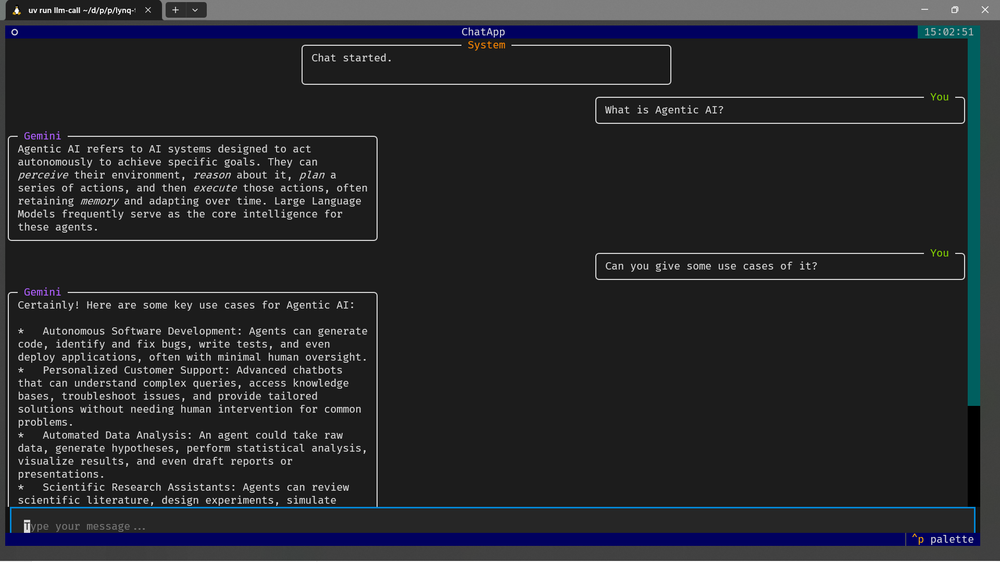
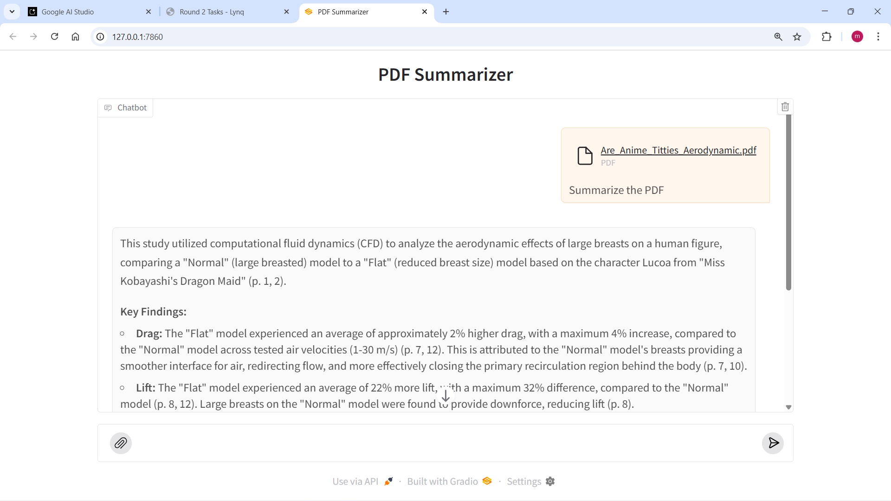
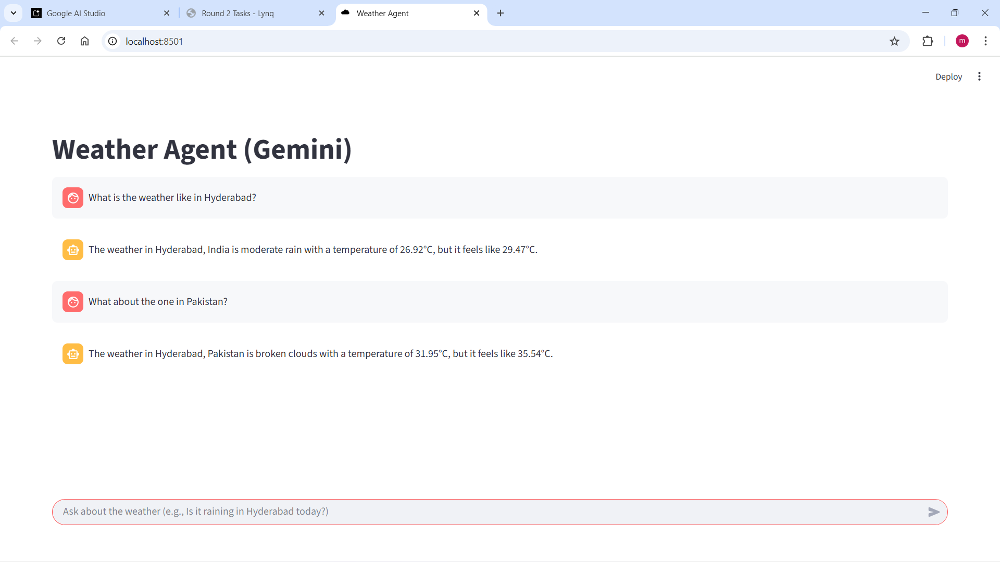

# lynq-task

Small multi-app workspace showcasing:
- A terminal LLM chat (Textual)
- A PDF summarizer (Gradio) backed by Google Gemini
- A simple weather app (Streamlit + OpenWeatherAPI + Google Gemini)


## Prerequisites
- Python 3.12+
- [uv](https://github.com/astral-sh/uv) for fast env + runner


## Quick start
1) Clone and enter the repo
2) Create a `.env` file with your API keys
3) Run any of the apps with `uv run`

### Environment variables
Put these in a `.env` file in the project root (auto-loaded by python-dotenv):

```
GEMINI_API_KEY=your_gemini_key
OPENWEATHER_API_KEY=your_openweather_key
```

## Install dependencies
You generally don’t need an explicit install step: `uv run` will resolve & run using `pyproject.toml`/`uv.lock`.

If you want to pre-sync the environment:
```
uv sync
```


## Health check
Prints dependency versions and validates required environment variables.

```
uv run checkhealth
```

Expected output includes dependency versions, .env discovery, and status lines like:
```
Environment variables:
	- GEMINI_API_KEY: set
	- OPENWEATHER_API_KEY: set
Summary: OK
```


## Run the apps

### 1) Terminal LLM Chat (Textual)
Run this preferably in a terminal app like Windows
```
uv run llm-call
```

(or if that doesn't work)

```
uv run textual run agentic_challenge/level1/llm_call.py
```

### 2) PDF Summarizer (Gradio)
Runs a chat UI where you can upload a PDF and ask questions. Uses Google Gemini with streaming responses.

```
uv run pdf-reader
```
(or if that doesn't work)
```
uv run python agentic_challenge/level1/pdf_reader.py
```

### 3) Weather App (Streamlit)
```
uv run weather-app
```
(or if that doesn't work)
```
uv run streamlit run agentic_challenge/level2/weather_app.py
```


## LLM API used:
- Google Gemini via the official `google-genai` client.
- Current model: `gemini-2.5-flash`.

## Project structure (high level)
```
agentic_challenge/
	level1/
		pdf_reader.py      # Gradio PDF summarizer (Gemini streaming)
		llm_call.py        # Textual terminal chat (Gemini)
	level2/
		weather_app.py     # Streamlit weather app (OpenWeather)
		weather_mcp.py     # MCP service (optional/dev)
	main.py              # utilities: check_health, helpers to run apps
```


## Screenshots / Sample IO (placeholders)

### Terminal LLM Chat (Textual)


### PDF Summarizer UI (Gradio)



### Weather App (Streamlit)



## Troubleshooting
- If `GEMINI_API_KEY` is missing, create a `.env` file as shown above.
- For fish shell, prefer `.env` or use `env VAR=... command` for one-off runs.
